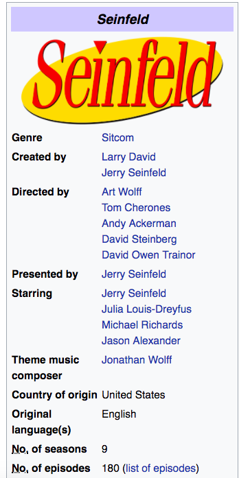

# Dictionaries 

### Introduction

We've spent the last couple of sections talking about one type of collection in Python, the list.  As we know, lists represent a collection of information that is ordered, like a list of the most watched TV shows.  Now, other times we may want our data to represent attributes of the same entity.  For example, various attributes of a single TV show.  For that, we can use a dictionary.

### Learning Objectives

* Understand how a dictionary allows us to represent attributes with keys and values
* Understand how to read a value from a dictionary
* Understand how to assign a key-value pair to a dictionary

### Creating a dictionary, and retrieving attributes

Imagine we want to represent information about the TV show Friends.  Our first step might be to go to Wikipedia to find some information.


As you can see, this information is presented in two columns, with the topics or headings to the left and their specific values to the right.  Now let's see how some of the above information can be represented as a dictionary in Python.


```python
friends = {'name': 'Friends', 'genre': 'sitcom', 'no_of_seasons': 10}
```

We create a dictionary with the braces, also called curly braces.  (On your keyboard, braces are located above the return key).  A dictionary is a group of key and value pairs, with the key to the left and the corresponding value to the right.      

Now that we have initialized a dictionary and assigned it to the variable, `friends`, we can retrieve the dictionary by referencing our variable.


```python
friends
```


    {'name': 'Friends', 'genre': 'sitcom', 'no_of_seasons': 10}


```python
friends['no_of_seasons']
```


    10


So to retrieve a specific value, we simply reference the dictionary, then the brackets, then the specific key.  The corresponding value is returned. 

### Assigning attributes and exploring the edge cases

Now that we know how to retrieve values, let's take our existing `friends` dictionary, and assign it more key-value pairs.  Here is what our dictionary currently looks like.


```python
friends
```


    {'name': 'Friends', 'genre': 'sitcom', 'no_of_seasons': 10}


Let's add a key of `no_of_episodes` with a value of 236.


```python
friends['no_of_episodes'] = 236
```


```python
friends
```


    {'name': 'Friends',
     'genre': 'sitcom',
     'no_of_seasons': 10,
     'no_of_episodes': 236}


So as you can see, our values of a dictionary can be any data type -- strings, numbers, and others.  How about keys?  Do keys have to be strings?  With programming, we don't always have to look up the answer.  We can just try things.


```python
friends[14] = 'some value'
```


```python
friends[14]
```


    'some value'


Apparently keys can also be integers.

Ok, let's get rid of that key - it doesn't make much sense.


```python
del friends[14]
```

We use the delete function, `del`, followed by the dictionary and the name of the key.  And now the key-value pair is gone.


```python
friends
```


    {'name': 'Friends',
     'genre': 'sitcom',
     'no_of_seasons': 10,
     'no_of_episodes': 236}


### Dictionaries with lists

If you look back up at our Friends table, you will see that there are two creators.  It probably makes sense to think of these creators as a list.


```python
creators = ['David Crane', 'Marta Kauffman']
```

So let's have our `friends` dictionary have a key of creators that points to this list. 


```python
friends['creators'] = ['David Crane', 'Marta Kauffman']
```


```python
friends
```


    {'name': 'Friends',
     'genre': 'sitcom',
     'no_of_seasons': 10,
     'no_of_episodes': 236,
     'creators': ['David Crane', 'Marta Kauffman']}


```python
friends['creators']
```


    ['David Crane', 'Marta Kauffman']


And of course, if we want to get the first creator in the list, and store it as a variable, we can.


```python
david = friends['creators'][0]
```

So in the above line, we referenced the dictionary, then got to the list of creators through using the key creators.  And now that we are pointing to that list, we use the brackets to reference the string at index zero.

###  Lists of Dictionaries

Now imagine we want to represent another TV show.



As you can see, Wikipedia provides us data similar to what we have for Friends.


```python
friends
```


    {'name': 'Friends',
     'genre': 'sitcom',
     'no_of_seasons': 10,
     'no_of_episodes': 236,
     'creators': ['David Crane', 'Marta Kauffman']}


  So let's represent our information for Seinfeld in a dictionary.


```python
seinfeld = {'name': 'Seinfeld', 'creators': ['Larry David', 'Jerry Seinfeld'], 'genre': 'sitcom', 'no_of_seasons': 10, 'no_of_episodes': 180}
```


```python
seinfeld
```


    {'name': 'Seinfeld',
     'creators': ['Larry David', 'Jerry Seinfeld'],
     'genre': 'sitcom',
     'no_of_seasons': 10,
     'no_of_episodes': 180}


Now that we have two TV shows, we can envision that having a list of TV shows.


```python
tv_shows = [friends, seinfeld]
tv_shows
```


    [{'name': 'Friends',
      'genre': 'sitcom',
      'no_of_seasons': 10,
      'no_of_episodes': 236,
      'creators': ['David Crane', 'Marta Kauffman']},
     {'name': 'Seinfeld',
      'creators': ['Larry David', 'Jerry Seinfeld'],
      'genre': 'sitcom',
      'no_of_seasons': 10,
      'no_of_episodes': 180}]


This is a nested data structure.  And it can be confusing to disentangle.  A good technique is to describe the data structure first before working with it.

So `tv_shows` is a list, with each element of the list being a dictionary.  The dictionary has a key of `creators` which itself points to another list. In describing the data structure, we look to the braces and brackets at the beginning.  `[{` means we are starting a list with a dictionary as the first element.  

Ok, now let's start working with this nested data structure.  First let's select the second creator of Seinfeld and set it equal to the variable `jerry`.  We'll retrieve this data in steps.  First, we'll select the correct TV show.


```python
tv_shows[1]
```


    {'name': 'Seinfeld',
     'creators': ['Larry David', 'Jerry Seinfeld'],
     'genre': 'sitcom',
     'no_of_seasons': 10,
     'no_of_episodes': 180}


Now we have the correct TV show.  Let's keep going.


```python
tv_shows[1]['creators']
```


    ['Larry David', 'Jerry Seinfeld']


Ok, almost there, we have our list of creators.


```python
tv_shows[1]['creators'][1]
```


    'Jerry Seinfeld'


So as you see above, we are now selecting the correct creator from the list.


```python
jerry = tv_shows[1]['creators'][1]
jerry
```


    'Jerry Seinfeld'


Ok so our approach here was to break this problem down into steps.  We first selected the correct TV show.  Then, we moved onto the `creators` attribute.  Finally, we retrieved the correct element from the list of creators.  

> As programmers, we tend not to get much smarter over time.  Instead, we develop skills for making problems easier to solve.  Taking the problem in steps, and checking our work at each of these steps is a technique we should continue to lean on.  It's the mark of a skilled developer.

### Summary

In this section, we saw a new type of collection, the dictionary.  A dictionary is a sequence of key-value pairs.  We mark the start and end of a dictionary with curly braces, `{}`, and then follow the pattern of `'key':'value'` for each of the associated attributes, with each attribute separated by a comma: `dictionary = {'key1':'value1', 'key2':'value2'}`.  

We retrieve a specific value from a dictionary by using the bracket accessor in combination with the key, so `dictionary['key2]'` returns `'value2'`.  And we add a new attribute with the format `dictionary['key3'] = 'value3'`.

Finally, we saw that we can represent data as nested data structures.  In working with nested data structures a good technique is to pay attention to the edges of the data structure as in `[{`, and then articulate how that data structure is nested.  Finally, when accessing data from a nested data structure, it is useful to break down the problem into steps to get feedback along the way.
